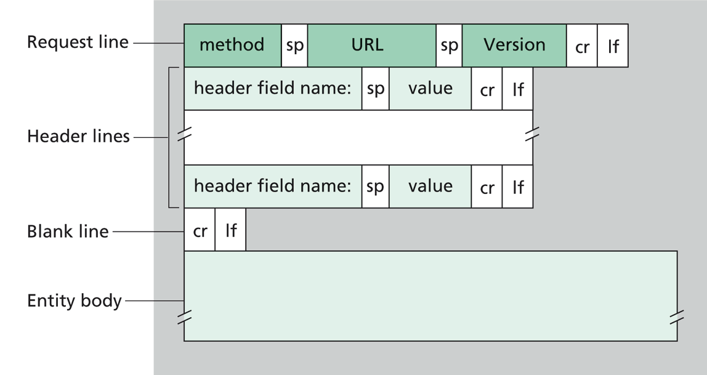
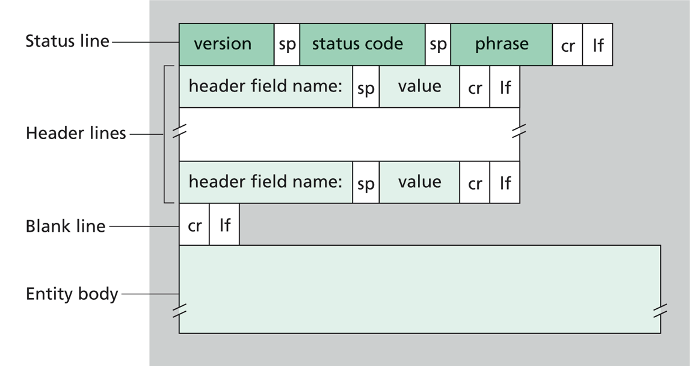

# HTTP
## Protocolo HTTP

### ¿Qué es un protocolo?
Conjunto de reglas que se deben seguir para poder obtener o lograr un determinado resultado o acceder a un determinado recurso o servicio.

### ¿Qué significa HTTP?
Según sus siglas, significa "Hypertext Transfer Protocol", es decir, protocolo de transferencia de hipertexto.

### ¿Qué establece el protocolo HTTP?
Permite que las solicitudes (Requests) y respuestas (Responses) entre clientes y servidores, tengan un determinado formato a seguir y respetar, para que puedan comunicarse sin inconvenientes.

En una comunicación HTTP sólo existen dos tipos de mensajes, los de solicitud (request) y los de respuesta (response).

## Request
Una request o solicitud que se utilizará en una comunicación que utiliza el protocolo HTTP, tiene una serie de partes, donde cada una de ellas cumple con una funcionalidad distinta respecto a la transmisión del mensaje que desea dar a conocer desde el cliente hacia el servidor.

- Método (GET, POST, PUT, DELETE) *
- Header (Cabecera)
- Body (Cuerpo)

## Response
Las respuestas o responses, al igual que las request, tienen una forma particular que les permiten transportar la información necesaria para atender a las solicitudes recibidas.

- Código de estado (Status code)
   - Códigos de rango: 100, 200, ..., 500 (https://http.cat/)
- Header (Cabecera)
- Body (Cuerpo)

## Métodos HTTP (also known as **HTTP verbs**)
| Método | Funcionalidad |
| :---:  |      :---     |
|  GET   | Solicita una representación de un recurso específico. Las peticiones que usan el método GET sólo deben recuperar (traer) datos. |
|  POST  | Se utiliza para enviar una entidad a un recurso en específico, causando a menudo un cambio en el estado o efectos secundarios en el servidor. |
|  PUT   | Reemplaza todas las representaciones actuales del recurso de destino con la carga útil de la petición. |
| DELETE | Borra un recurso en específico. |
|  PATCH | Es utilizado para aplicar modificaciones parciales a un recurso. |

Existen un montón *(más)* de métodos/verbos para peticiones HTTP, *(https://developer.mozilla.org/es/docs/Web/HTTP/Methods)*
